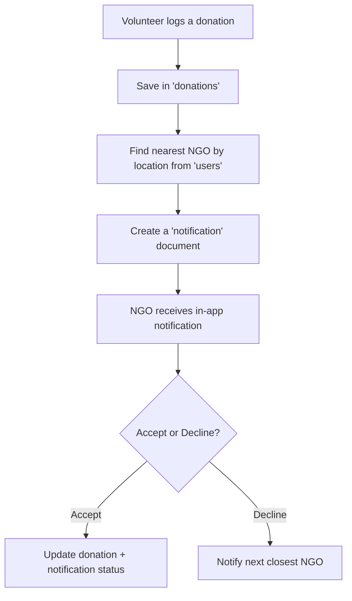

# Hand2Hand - Help Made Simple 💚

A community-driven mobile application that bridges the gap between **volunteers**, **NGOs**, and **resource donors** to ensure efficient distribution of resources like food, clothing, medicine, and more.

##  Features

-  **Geo-based Notifications**  
  Notifies the **nearest NGO** based on the volunteer's real-time location when resources are available.

-  **Fallback Logic**  
  If an NGO **declines** a request, the system automatically forwards it to the **next nearest NGO**, ensuring no help goes unanswered.

-  **In-App Notification Inbox**  
  Both volunteers and NGOs have access to a real-time notification center for seamless communication and coordination.

-  **Impact Analytics** *(Upcoming)*  
  Track resources saved, requests completed, NGO participation, and community impact.

-  **Multi-Language Support** *(Upcoming)*  
  Breaking language barriers by supporting regional languages for inclusive accessibility.

-  **Offline Functionality** *(Upcoming)*  
  Enable resource logging and request queuing in remote areas with poor internet connectivity.


## Tech Stack

### Framework & Structure
- **Flutter** – Core mobile app framework for cross-platform development   
- **Open and Show Map (flutter_map + latlong2)** – Interactive maps using OpenStreetMap and distance-based logic 

### Backend
- **Firebase Firestore** – Real-time NoSQL cloud database for user, donation, and notification data  
- **Firebase Authentication** – Secure user sign-in and session management
- **Firebase Performance** – Monitoring app performance in real-time  
- **Cloud Functions (planned/future)** – For serverless backend logic (future scope)

### APIs & Packages
- **Gemini API (Google AI)** – For intelligent text or media generation and assistance  
- **Google IDX** – For AI-assisted development and cloud-based coding  
- **Geolocator** – To retrieve device location for volunteers and NGOs  
- **latlong2** – For distance calculation and sorting NGOs based on proximity

###  Utility & State Management
- **Provider** – Lightweight state management  
- **GoRouter** – Declarative routing in Flutter  
- **Shared Preferences** – Local key-value storage  
- **Cached Network Image** – Efficient image loading and caching
  

##  Project Structure

```
lib/
├── 📂 auth/                        # Authentication logic (login, signup)
├── 📂 backend/                     # Firestore & API interaction layer
├── 📂 components/                  # Reusable UI components
├── 📂 filler/                      # Placeholder/dev-stage widgets
├── 📂 help/                        # Help & support screens
├── 📂 home_page/                   # Home screen for users
├── 📂 login_page/                  # Login UI and logic
├── 📂 main_code/widgets/           # Core functional widgets
├── 📂 map/                         # Location-based logic using open_and_show_map
├── 📂 n_g_o_notification_inbox/   # NGO notifications & inbox
├── 📂 n_g_o_profile/              # NGO profile management
├── 📂 ngo_landing_page/           # NGO dashboard
├── 📂 on_boarding_page/           # Onboarding flows for new users
├── 📂 smart_volunteer_notifier/   # Custom widget for fallback NGO notifications
├── 📂 stylings/                   # App-wide themes & styles
├── 📂 volunteer_landing_page/     # Volunteer dashboard
├── 📂 volunteer_profile/          # Volunteer profile settings

├── 📄 app_state.dart              # App-wide state management
├── 📄 index.dart                  # Central export hub for all route widgets
└── 📄 main.dart                   # Main Flutter app entry point

```

## 🛠 Setup Instructions

1. **Clone the Repository**  
   ```bash
   git clone https://github.com/akshat2474/Hand2Hand
   ```

2. **Open in IDE of your choice**  

3. **Firebase Setup**
   - Enable Firebase Auth (Email/Password)
   - Create `users`,`donations` and `notifications` collections
   - Add Firestore rules accordingly

4. **Configure Geolocator Plugin**  
   Ensure location permissions are handled for Android & iOS.

5. **Run the App**
   ```bash
   flutter run
   ```

## 🔄 Notification Flow (Simplified)



##  Collections Overview (Firestore)

###  `users`

Contains user profiles for both volunteers and NGOs.

- `bio` (string)  
- `city` (string)  
- `created_time` (timestamp)  
- `display_name` (string)  
- `email` (string)  
- `latitude` (number)  
- `longitude` (number)  
- `role` (string): `"Volunteer"` or `"NGO"`  
- `uid` (string)  
- `updatedAt` (timestamp)


###  `donations`

Each document represents a donation posted by a user.

- `description` (string)  
- `itemType` (string)  
- `quantity` (number)  
- `status` (string): `"pending"`, `"accepted"`, `"completed"`  
- `timestamp` (timestamp)  
- `userId` (string)


###  `notifications`

Tracks messages sent from volunteers to NGOs regarding donations.

- `donationRef` (reference)  
- `isRead` (boolean)  
- `location` (geopoint)  
- `message` (string)  
- `recipientID` (string)  
- `recipientName` (string)  
- `senderID` (string)  
- `senderName` (string)  
- `status` (string): `"pending"`, `"accepted"`, `"declined"`  
- `timestamp` (timestamp)  
- `type` (string): e.g., `"food_donation"`, `"clothing_donation"`

## Contributing

We welcome contributions from developers, NGOs, and tech-for-good enthusiasts!

1. Fork the repo  
2. Create a new branch  
3. Make your changes  
4. Submit a pull request

## 📄 License

Licensed under the **MIT License**.  
Feel free to use and improve the project with proper attribution.

Made by: Akshat Singh and Anant Singhal
